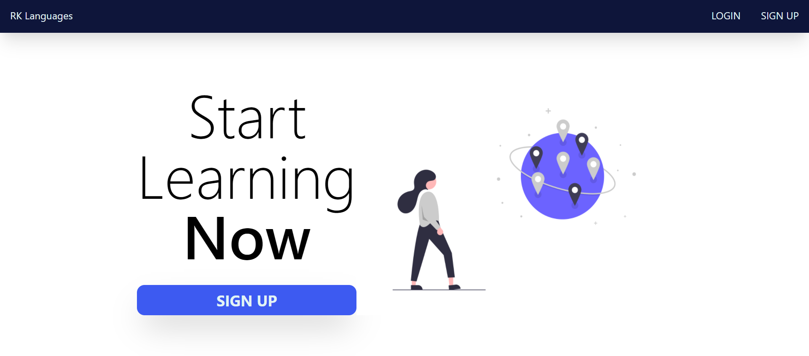

<!-- Banner -->

<div align="middle">

<!-- Image -->


<br>
<!-- Short intro -->
<p>RKLanguages is a language learning based social network. It allows people to interact with native speakers of their target language.</p>

<p>(This is the frontend repository for RKLanguages. For the backend repository, <a href="https://github.com/LombaxTech/Language-Exchange-Backend"> click here </a>)</p>
</div>

<br>

<!-- Screenshot Homepage -->


<!-- Try It Out (Installation) -->

## Try It Out

```sh
git clone https://github.com/LombaxTech/Language-Exchange-Frontend.git
```

```sh
npm start
```

(Make sure the backend is also running)

<!-- Feature List -->

## Features

-   User Auth
-   Image Upload
-   Real Time Messaging
-   Post
-   Like & Comment

<!-- Made Using -->

## Made using

-   [React.js](https://reactjs.org/)
-   [Tailwind CSS](https://tailwindcss.com/)
-   [Socket.io](https://socket.io/)
